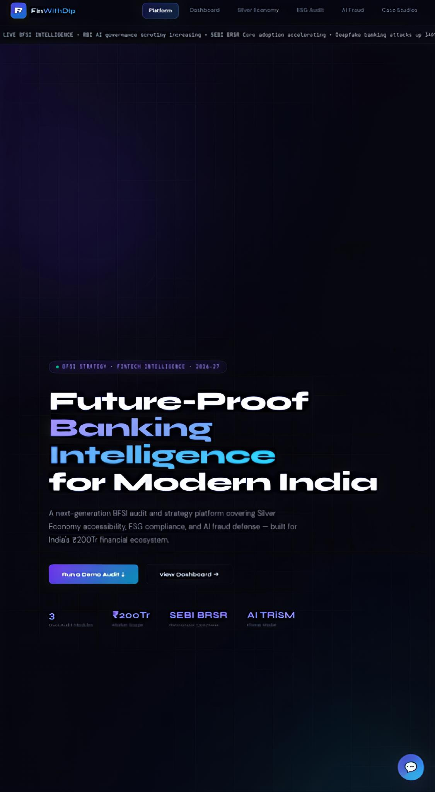
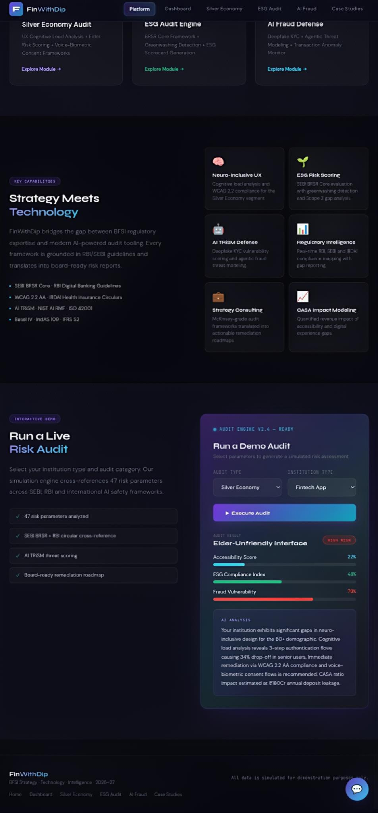
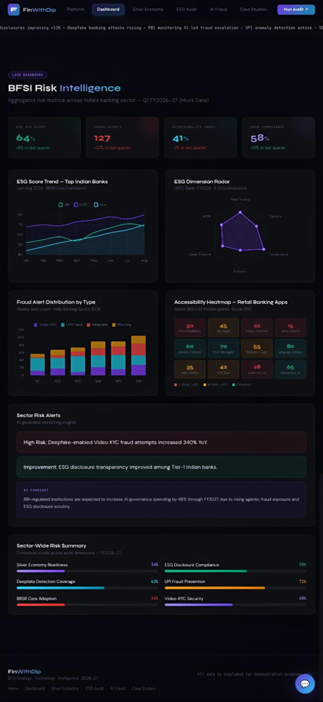
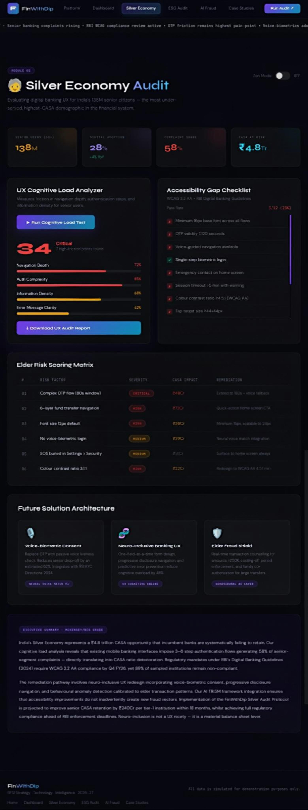
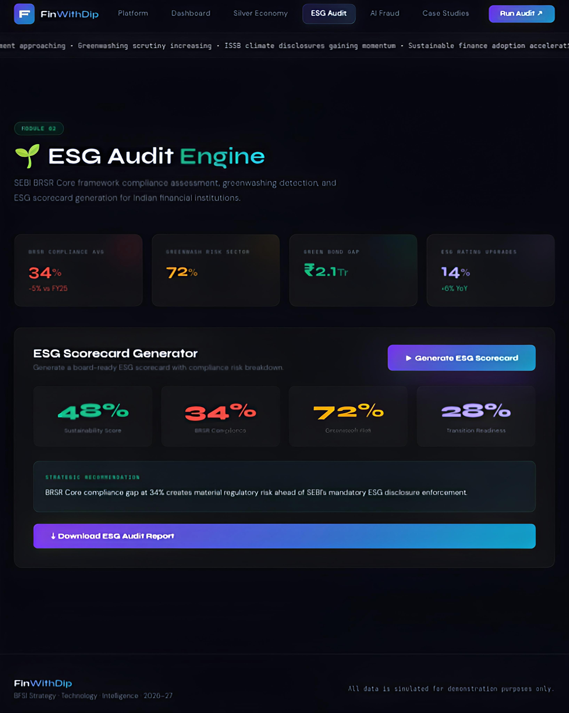
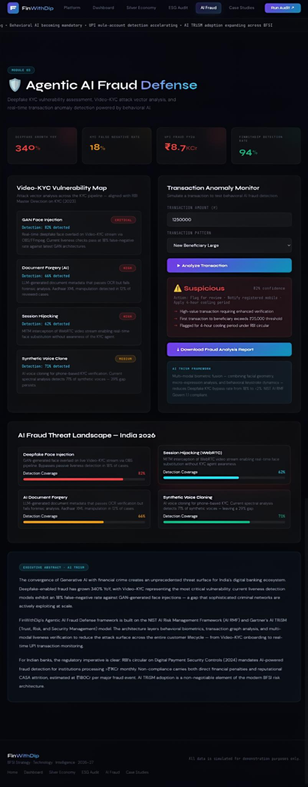
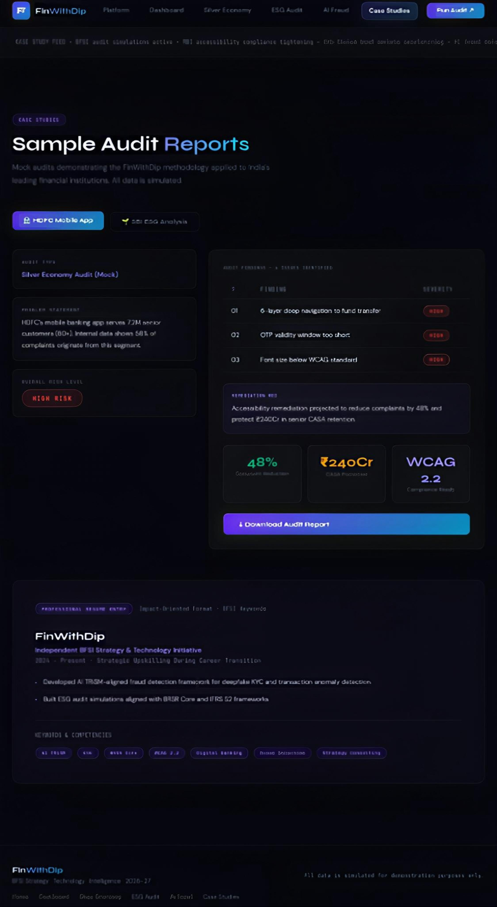
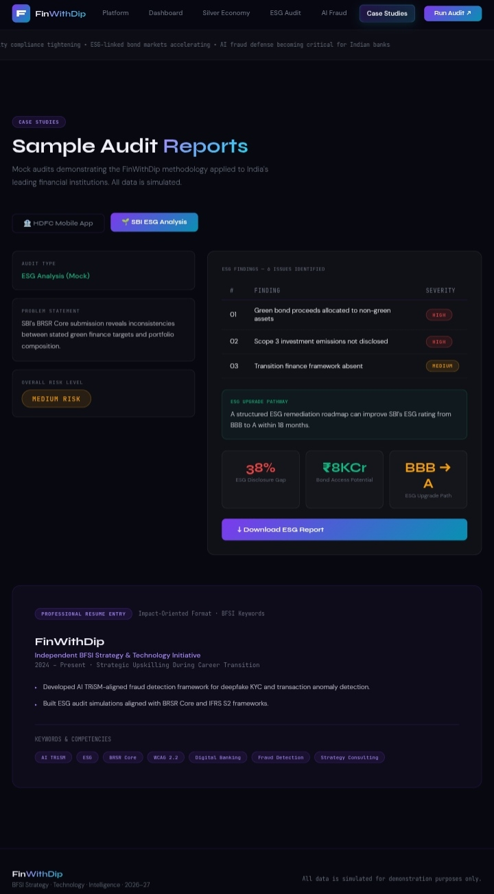

# 🚀 FinWithDip

### Future-Proof Banking Intelligence for Modern India

FinWithDip is a next-generation BFSI strategy, compliance, accessibility, ESG, and AI fraud intelligence platform designed for India's evolving financial ecosystem.

Built as a premium multi-module web platform featuring:
- Silver Economy banking audits
- ESG risk & compliance intelligence
- AI-powered fraud defense simulations
- Interactive BFSI dashboards
- Case-study driven audit systems

---

# 🌐 Live Demo

🔗 https://iamdip-sk10.github.io/finwithdip/

---

# 📸 Platform Preview

## 🏠 Homepage


<br>



---

## 📊 BFSI Risk Dashboard


---

## 👴 Silver Economy Audit


---

## 🌱 ESG Audit Engine


---

## 🛡 AI Fraud Defense


---

## 📑 Case Studies — Silver Economy


---

## 📑 Case Studies — ESG Audit


---

# 🧠 Core Modules

## 1. Platform Overview
- Premium futuristic BFSI landing platform
- Interactive risk intelligence sections
- Regulatory-focused design system

## 2. BFSI Dashboard Intelligence
- ESG analytics dashboard
- Fraud intelligence monitoring
- Accessibility heatmaps
- Sector-wide risk scoring
- Interactive visual analytics

## 3. Silver Economy Audit
Focused on India's growing senior-citizen banking demographic:
- Cognitive load analysis
- Accessibility scoring
- WCAG 2.2 evaluation
- CASA impact modeling
- Elder fraud vulnerability assessment

## 4. ESG Audit Engine
Enterprise-grade ESG simulation module:
- SEBI BRSR Core alignment
- Greenwashing risk detection
- ESG scorecard generation
- Disclosure gap analysis
- Sustainability readiness scoring

## 5. AI Fraud Defense
AI TRiSM-inspired fraud intelligence engine:
- Deepfake Video-KYC analysis
- Transaction anomaly simulation
- Voice-clone fraud assessment
- Behavioral fraud scoring
- RBI-aligned fraud defense workflows

## 6. Case Studies Engine
Interactive audit simulation reports:
- Silver economy banking case studies
- ESG audit remediation scenarios
- Impact projections
- Risk scoring systems

---

# ✨ Features

- Premium futuristic UI/UX
- Glassmorphism design system
- Interactive analytics modules
- Animated dashboards
- AI-inspired fraud simulation
- ESG audit frameworks
- Accessibility audit models
- Fully responsive design
- Mobile-first optimized experience
- Real-time styled intelligence feed
- Dynamic navigation highlighting

---

# 🛠 Tech Stack

- HTML5
- CSS3
- Vanilla JavaScript
- Responsive Design
- Glassmorphism UI
- Custom CSS animations
- Interactive dashboard components

---

# 📈 Design Philosophy

FinWithDip combines:
- BFSI strategy consulting aesthetics
- Enterprise dashboard systems
- AI governance visual intelligence
- Regulatory-first UX architecture
- Futuristic fintech product design

Inspired by:
- McKinsey-style consulting interfaces
- Bloomberg terminal-inspired layouts
- AI governance dashboards
- Neo-banking UI systems

---

# 📱 Responsive Experience

Optimized for:
- Desktop
- Tablets
- Mobile devices

Built with fully responsive layouts and adaptive UI scaling.

---

# ⚠ Disclaimer

All analytics, ESG scores, fraud metrics, risk indicators, accessibility findings, and banking datasets shown in this project are simulated for educational and demonstration purposes only.

This project does not represent real institutional audit outputs or regulatory assessments.

---

# 👨‍💻 Author

Developed by **Subha Dip**

BTech IT • BFSI Strategy • AI Governance • Digital Innovation

---

# 🔮 Future Enhancements

- Real AI-powered audit engine
- Authentication system
- Exportable audit reports
- Live financial APIs
- Dynamic chart integration
- AI chatbot integration
- Advanced fraud scoring engine
- ESG benchmarking system

---

# ⭐ Support

If you liked this project, consider starring the repository.

```bash
git clone https://github.com/iamdip-sk10/finwithdip.git
```

---

# 📄 License

This project is developed for educational, portfolio, and demonstration purposes.
